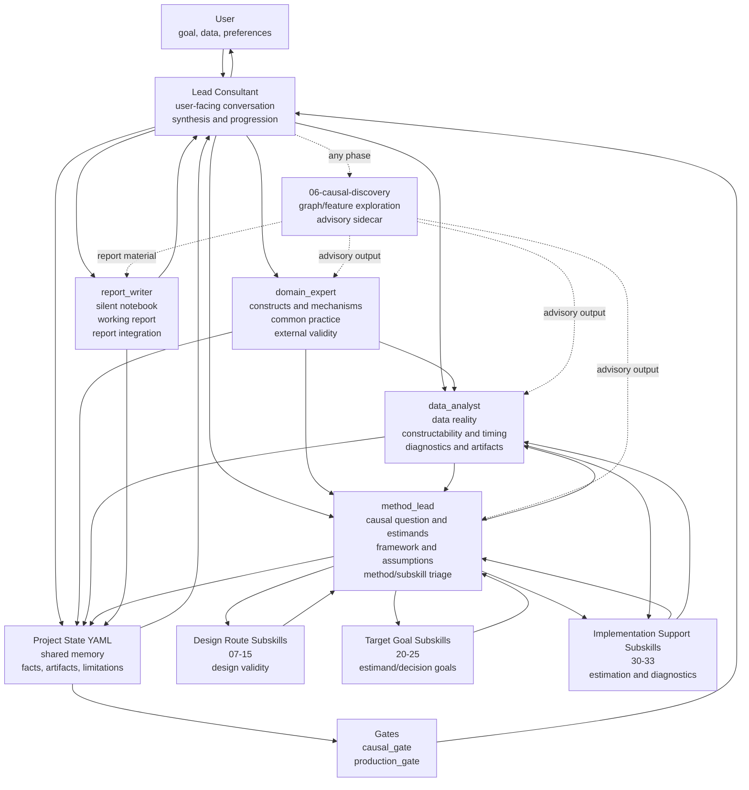

# A Causal Consultant Skill

[](https://www.gnu.org/licenses/gpl-3.0) []() []()

*A Modular Consultant Team (MCT) skill for causal reasoning, data feasibility, analysis framework selection, diagnostics, interpretation, and report production.*

---

## What This Skill Is About

This is a causal inference consultant skill for agent systems that load a top-level `SKILL.md` and then selectively read supporting references, subskills, scripts, examples, schemas, and templates. It helps a user move from an informal causal question to a defensible causal specification, useful exploratory or diagnostic analysis, appropriate method/task specialist support, and a report or memo with clear claim boundaries.

The new version uses a Modular Consultant Team (MCT) architecture: a user-facing lead consultant coordinates four core team members, `domain_expert`, `data_analyst`, `method_lead`, and silent `report_writer`. The lead consultant keeps the conversation coherent, while the core team preserves domain meaning, data reality, causal validity, and reportability. Method/task subskills are used as bounded specialist modules only when they are useful.

The skill keeps a compact project state with the user's goal, project phase, working facts, domain guidance, data properties, candidate frameworks, estimands, assumptions, diagnostics, limitations, recommended or activated subskills, and report materials. As new information appears, the workflow can recheck earlier decisions, revise the analysis framework, narrow the estimand, request a bounded data diagnostic, produce a qualified progress artifact, or explain why a causal claim is not yet supported.

It is for data scientists, analysts, researchers, domain experts, and applied teams who want a careful causal partner rather than a black-box method picker. It can support exploratory planning, data audit, design critique, DAG/theory reasoning, method selection, causal discovery sidecar work, R/Python code examples, diagnostic review, result interpretation, and reproducible reporting.

The core safety rule is simple: causal language should never be stronger than the design, assumptions, data support, diagnostics, and sensitivity checks justify.

> I cannot give you a definitive answer, but I can help you explore.

---

## How To Activate

Say one of the following phrases in your request:

- "causal inference"
- "causal discovery"
- "policy effect estimation"
- "treatment decision making"
- "individualized treatment rules"
- "causal effect report"
- "causal analysis plan"
- "can we call this causal?"

---

## How To Install

One Codex-friendly example when this skill folder is the repository root:

```powershell
py "$env:USERPROFILE\.codex\skills\.system\skill-installer\scripts\install-skill-from-github.py" `
  --repo rqzhu-aide/causal-consultant `
  --path . `
  --name causal-consultant
```

If this folder lives inside a larger repository, set `--path` to the folder that contains this `SKILL.md`, for example:

```powershell
py "$env:USERPROFILE\.codex\skills\.system\skill-installer\scripts\install-skill-from-github.py" `
  --repo rqzhu-aide/causal-consultant `
  --path causal-consultant-v2 `
  --name causal-consultant
```

After installation, restart the agent app if needed so it can discover the skill.

---

## Interactive Modular Consultant Team Architecture

For a standalone copy of this diagram, see [`assets/workflow-mermaid.md`](assets/workflow-mermaid.md).



This Modular Consultant Team (MCT) workflow is interactive because it treats causal work as an adaptive conversation rather than a one-shot method checklist. The user, available data, durable artifacts, and current project YAML provide observations. The lead consultant reads those observations, coordinates the core team, chooses the next useful internal step, and speaks back to the user in plain language without exposing backend YAML mechanics.

The top-level `SKILL.md` is intentionally frontstage and short. It defines the lead consultant's user-facing behavior, team boundaries, working phases, and backend reference map. Detailed operating logic lives in:

- `references/backend_workflow.md`
- `references/yaml_management.md`
- `references/team_coordination.md`
- `references/subskill_coordination.md`
- `references/conversation_boundary.md`

The MCT structure has four core members and one sidecar:

- **`domain_expert` (`01-domain-expert`)** preserves domain meaning: constructs, mechanisms, temporal order, measurement standards, common practice, external validity, and wording cautions.
- **`data_analyst` (`02-data-analyst`)** evaluates data reality: available sources, row and analysis units, timing, variable construction, missingness/selection, support, exploratory outputs, reproducible artifacts, and data-evidence handoffs.
- **`method_lead` (`03-method-lead`)** owns causal-method judgment: causal questions, framework candidates, selected framework, estimand set, assumptions, DAG/theory, diagnostics, sensitivity, method literature, and method/task subskill triage.
- **`report_writer` (`05-report-writer`)** is silent. It keeps a polished project notebook and working report from early durable content through production reporting and same-evidence revisions.
- **`06-causal-discovery`** is an any-phase sidecar for exploratory graph learning, graph comparison, variable screening, constructed-feature ideas, and discovery-only deliverables. Its outputs remain advisory until reviewed through the relevant core team logic.

Three working phases organize the interaction:

1. **`project_exploration`**: learn the user's goal, domain setting, data reality, feasibility, and possible candidate frameworks. Exploratory, descriptive, diagnostic, and design-learning work can happen here when data are provided.
2. **`causal_specification`**: settle and stress-test the causal claim, estimand set, framework, DAG/theory, assumptions, diagnostics, sensitivity plan, data feasibility, and wording boundary.
3. **`report_production`**: draft, diagnose, revise, improve, and deliver the report or other user-facing artifact. The project stays in this phase for report revisions unless new evidence changes the causal claim, estimand set, assumptions, framework, or core design logic.

Two gates control claim readiness:

- **`causal_gate`** decides whether the causal claim, framework, assumptions, and wording boundary are ready enough for reportable use.
- **`production_gate`** decides whether evidence, diagnostics, provenance, and materials are ready enough for a polished deliverable.

The gates do not forbid progress. If work is blocked or incomplete, the team can still produce exploratory analysis, prototype code, diagnostics, or limitation-forward reports, but those artifacts must visibly carry the appropriate caveats and claim-strength limits.

With this structure in place, the practical loop is:

1. Update the compact project state from the user's latest turn.
2. Let `domain_expert`, `data_analyst`, and `method_lead` review in the default order.
3. Allow one bounded adaptive follow-up pass only when a reviewer update would clearly improve the next user-facing move.
4. Let `report_writer` update the working notebook/report when there is substantive content to preserve.
5. Update gates, limitations, agenda, and next action.
6. Return to the user with one clear practical move: a question, explanation, proposed analysis, method choice, artifact, or revision.

This keeps the interaction collaborative instead of over-automated. The team does enough internal work to be useful, then returns to the user when a clarification, permission, preference, or review would improve the next step.

Method/task subskills are organized into three specialist pools:

- **Design routes (`07`-`15`)**: randomized assignment, observational exposure, longitudinal g-methods, DiD/event study, RD, IV/MR, synthetic control/time series, interference/spillovers, and negative controls/proximal methods.
- **Target goals (`20`-`25`)**: heterogeneous effects, point treatment rules, mediation, dose-response effects, transportability/generalizability, and dynamic treatment policies.
- **Implementation support (`30`-`33`)**: matching/weighting/balance, doubly robust estimation, Double Machine Learning, and survival/competing risks.

The helper `scripts/recommend_subskills.py` provides advisory recall for specialist modules, but it is not a router or judge. `method_lead` makes the causal-method decision after reading `domain_expert`, `data_analyst.method_support`, project state, and any relevant `subskill_records`.

The durable state model lives in `assets/causal_project_spec_template.yaml`; controlled values live in `assets/workflow_enums.yaml`; activated method/task subskills use `assets/method_job_subskill_record_template.yaml`. Validation scripts are provided in `scripts/`.

The result is a lean MCT workflow that stays conversational during exploration, becomes disciplined during causal specification, and remains report-focused through production and revision without treating internal machinery as user-facing content.
