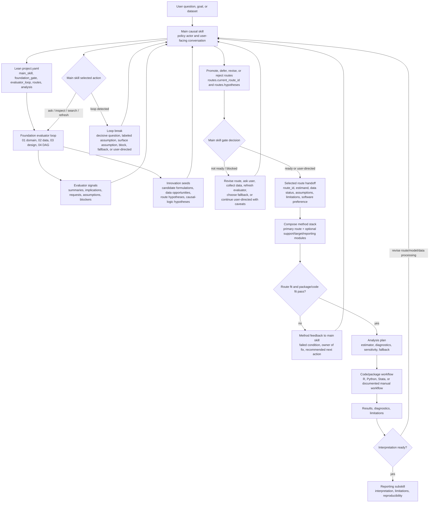

# Causal-Skills Workflow Diagram

This diagram is a visual map of the workflow. The source of truth is the main `SKILL.md`, the subskill `SKILL.md` files, and the lean `project.yaml` contract.

## Key Design Principles

1. **Main skill owns policy and gate decisions** - Foundation evaluator readiness values are signals, not automatic gate openers.
2. **Foundation evaluators maintain state** - Domain, data, design, and DAG subskills update only their lean evaluator records and provide implications to the main skill.
3. **Method subskills have roles** - Primary route subskills check design families, support modules add estimators/diagnostics, target modules change the estimand target, discovery modules explore graphs, and reporting modules communicate results.
4. **Package lists are candidate maps** - A package is appropriate only if the method stack confirms it supports the estimand, data structure, diagnostics, and uncertainty needs.
5. **User-directed progress is allowed but labeled** - The user can force workflow pace, not unqualified causal validity.
6. **Loop control prevents circular evaluation** - Repeated unresolved blockers trigger a main-skill loop-break action.
7. **Detailed work leaves the shared YAML** - Full audits, code, diagnostics, DAGs, reports, and route memos belong in `analyses/` or `artifacts/`, with compact summaries in `project.yaml`.
