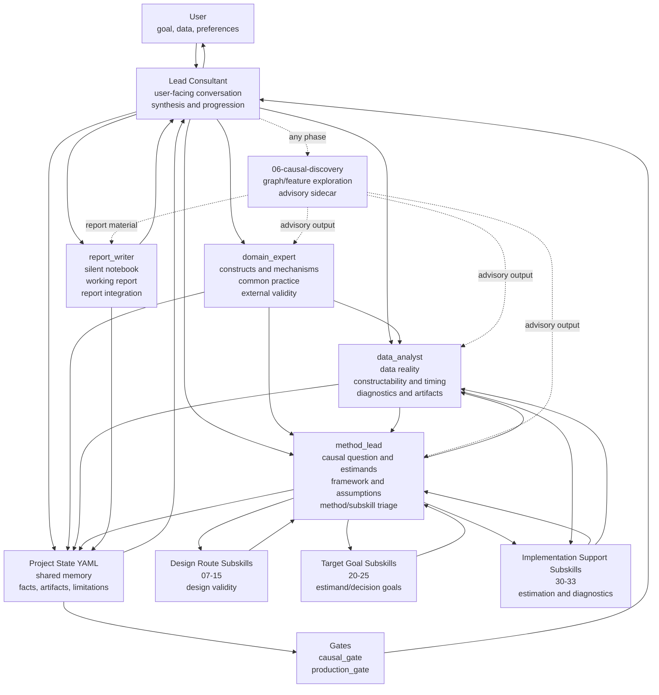

# Causal Consultant V2 Workflow

The lead consultant is the only user-facing node. Core reviewers update their own areas of project state. Method/task subskills are specialist modules: they provide route, target, implementation, diagnostic, or report-support guidance but do not own gates or speak to the user.
