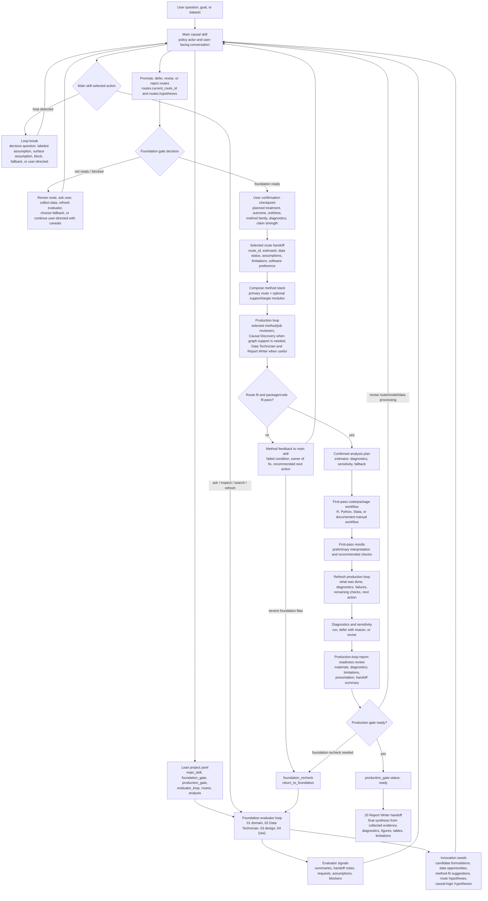

# Causal Consultant Workflow Diagram

This diagram is a visual map of the workflow. The source of truth is the main `SKILL.md`, the subskill `SKILL.md` files, and the lean `project.yaml` contract.

## Key Design Principles

1. **Main skill owns both gates** - Foundation evaluator and production reviewer readiness values are signals, not automatic gate openers.
2. **Foundation evaluators are transitional kernel functions** - Domain, Data Technician, design, and DAG subskills update only their lean evaluator records and provide handoff notes to the main skill before `foundation_gate`.
3. **Production reviewers make materials real** - Method/job subskills, Data Technician, Causal Discovery for graph support, and Report Writer can be selected in `analysis.production_loop` after `foundation_gate` opens.
4. **Production work has its own review loop** - `analysis.production_loop` records selected reviewers, review purpose, what has been done, remaining checks, diagnostics readiness, polishing needs, loop control, and the next action.
5. **Production can return to foundation** - Severe production findings can trigger `analysis.production_loop.foundation_recheck` and `return_to_foundation`.
6. **Method/job and discovery YAML is append-only when activated** - Use `assets/method_job_subskill_record_template.yaml` for compact `subskill_analyses` records; do not pre-create blank method/job or discovery sections.
7. **Report Writer handoff is after production gate** - `20-report-writer` may advise during production, but only takes over final report synthesis after `production_gate.status: ready`; handoff uses recorded foundation and production evidence rather than starting another interaction loop.
8. **Data Technician informs method fit** - Method suggestions should reflect the current design, DAG, observed data structure, feasible diagnostics, and package constraints.
9. **Package lists are candidate maps** - A package is appropriate only if the method stack confirms it supports the estimand, data structure, diagnostics, and uncertainty needs.
10. **User-directed progress is allowed but labeled** - The user can force workflow pace, not unqualified causal validity.
11. **Interactive checkpoints prevent runaway execution** - Foundation-ready routes require brief plan confirmation, first-pass results should lead to diagnostics or sensitivity decisions, production-loop review gates report handoff, and final reports are owned by Report Writer after production gate.
12. **Loop control prevents circular evaluation** - Repeated unresolved blockers trigger a main-skill loop-break action.
13. **Detailed work leaves the shared YAML** - Full audits, code, diagnostics, DAGs, reports, and route memos belong in `analyses/` or `artifacts/`, with compact summaries in `project.yaml`.
