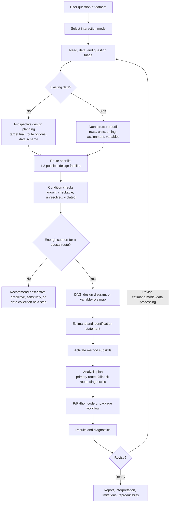

# Causal-Skills Workflow Diagram

This diagram shows the intended interaction loop from initial user need to defensible causal analysis.

## Key Design Principles

1. **Need-aware interaction** - Start from the user's requested deliverable, not a fixed questionnaire.
2. **Data-structure-first routing** - Identify rows, units, timing, assignment, and variable roles before choosing methods.
3. **Route narrowing** - Compare a small set of plausible design families by their required conditions.
4. **Causal structure before code** - Use a DAG, design diagram, or variable-role map to specify the estimand and assumptions.
5. **Package-aware but design-led** - Adapt data to packages only when the transformation is scientifically meaningful and documented.
6. **Iterative refinement** - Use diagnostics and user feedback to revise the estimand, route, model, or interpretation.
