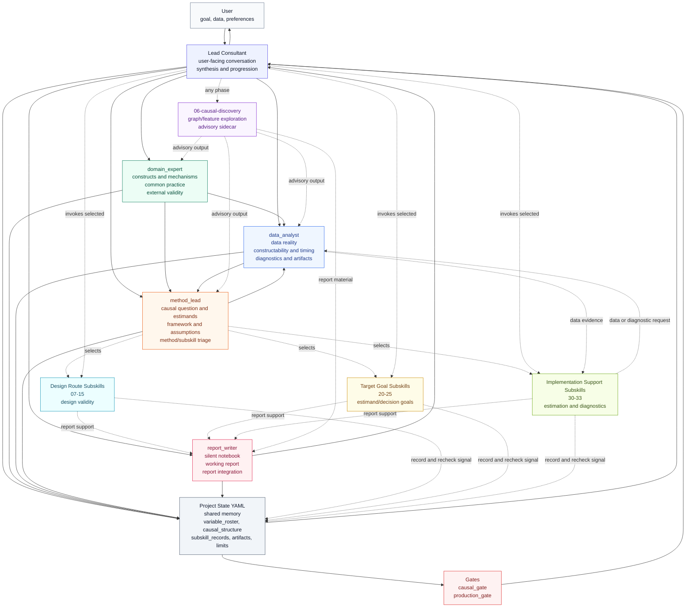

# Causal Consultant V2 Workflow

Colors distinguish the lead/state layer, each core member, causal discovery, method/task specialist pools, and gates. The lead consultant is the only user-facing node. Core reviewers update their own areas of project state. `method_lead` selects bounded specialist modules, the lead consultant invokes them, and returned packets are recorded in `subskill_records`. Method/task subskills provide route, target, implementation, diagnostic, or report-support guidance but do not own gates or speak to the user.
