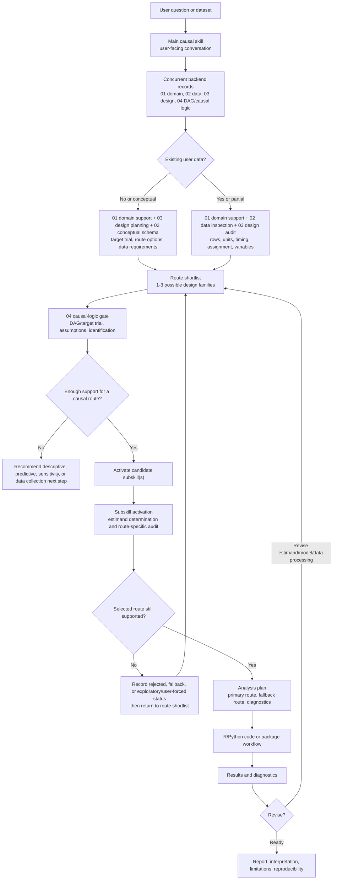

# Causal-Skills Workflow Diagram

This diagram shows the intended interaction loop from initial user need to defensible causal analysis.

## Key Design Principles

1. **Need-aware interaction** - Start from the user's requested deliverable, not a fixed questionnaire.
2. **Concurrent foundation records** - Keep the main skill, domain support, data inspection, design planning, and DAG/causal logic active together.
3. **Data and design before method** - Identify rows, units, timing, assignment, and variable roles before choosing methods.
4. **Design frames routing; causal logic checks it** - Use the design record for high-level feasible routes, then use the DAG/target-trial record for identification, adjustment, and method-selection implications.
5. **Tool fit, data suitability, and causal validity together** - Use packages only when their assumptions and outputs match the planned causal claim.
6. **Iterative refinement** - Use diagnostics and user feedback to revise the estimand, route, model, or interpretation.
