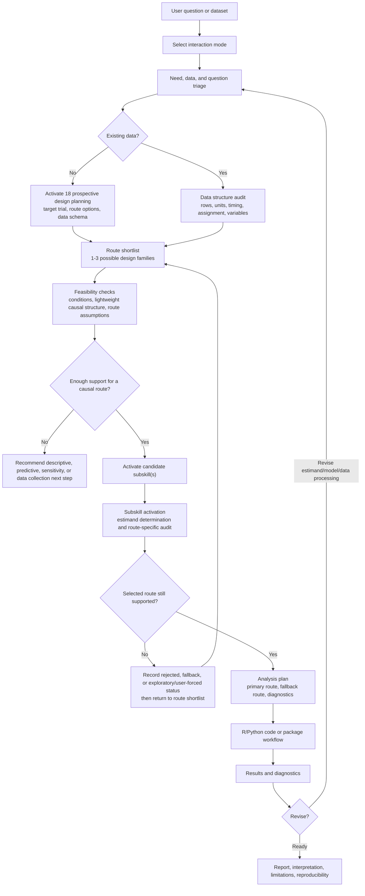

# Causal-Skills Workflow Diagram

This diagram shows the intended interaction loop from initial user need to defensible causal analysis.

## Key Design Principles

1. **Need-aware interaction** - Start from the user's requested deliverable, not a fixed questionnaire.
2. **Data-structure-first routing** - Identify rows, units, timing, assignment, and variable roles before choosing methods.
3. **Route narrowing** - Compare a small set of plausible design families by their required conditions.
4. **Causal structure before code** - Use a DAG, design diagram, assignment summary, or variable-role map when it helps define the route, estimand, or assumptions.
5. **Tool fit, data suitability, and causal validity together** - Use packages only when their assumptions and outputs match the planned causal claim.
6. **Iterative refinement** - Use diagnostics and user feedback to revise the estimand, route, model, or interpretation.
